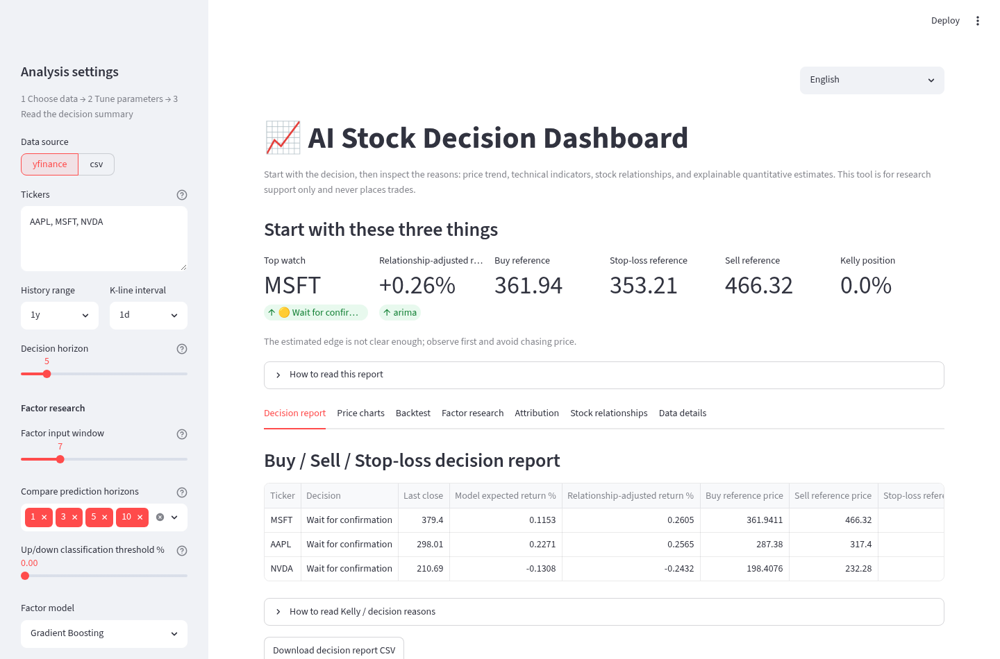
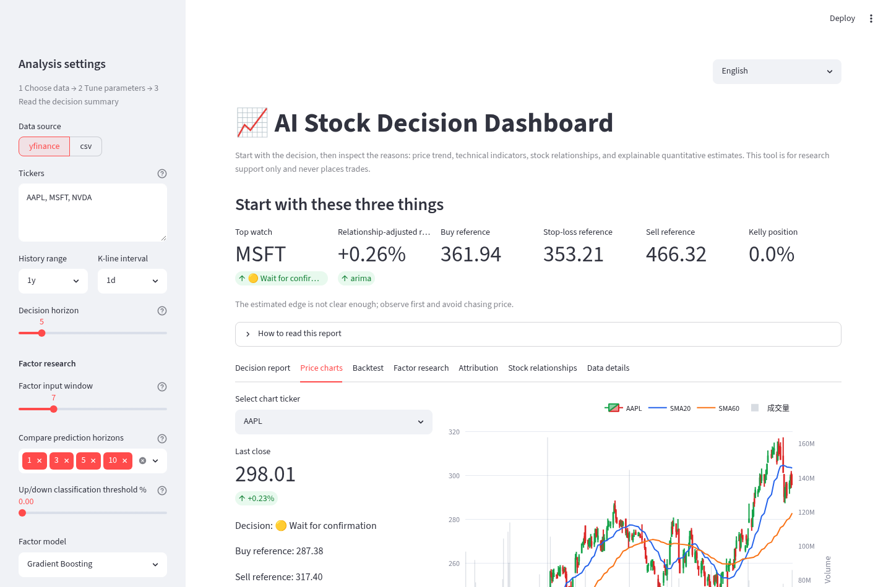
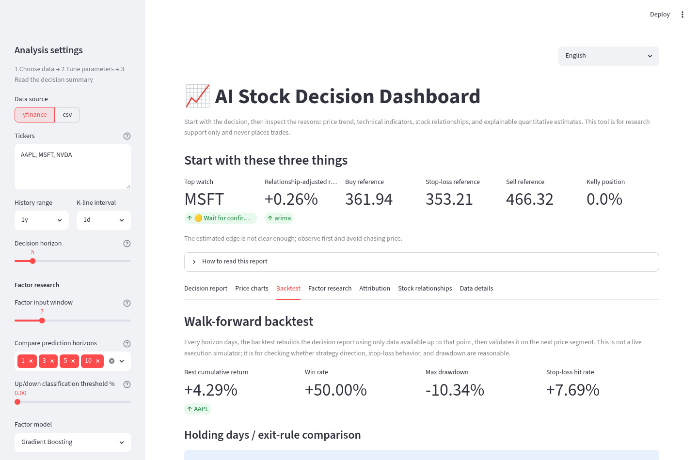
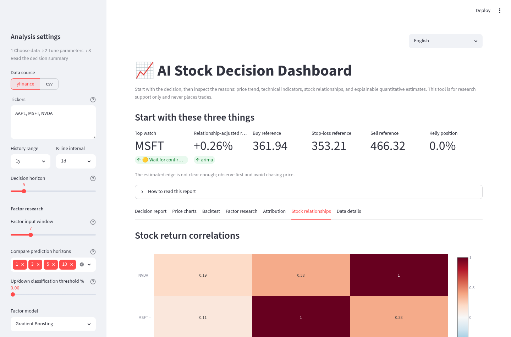
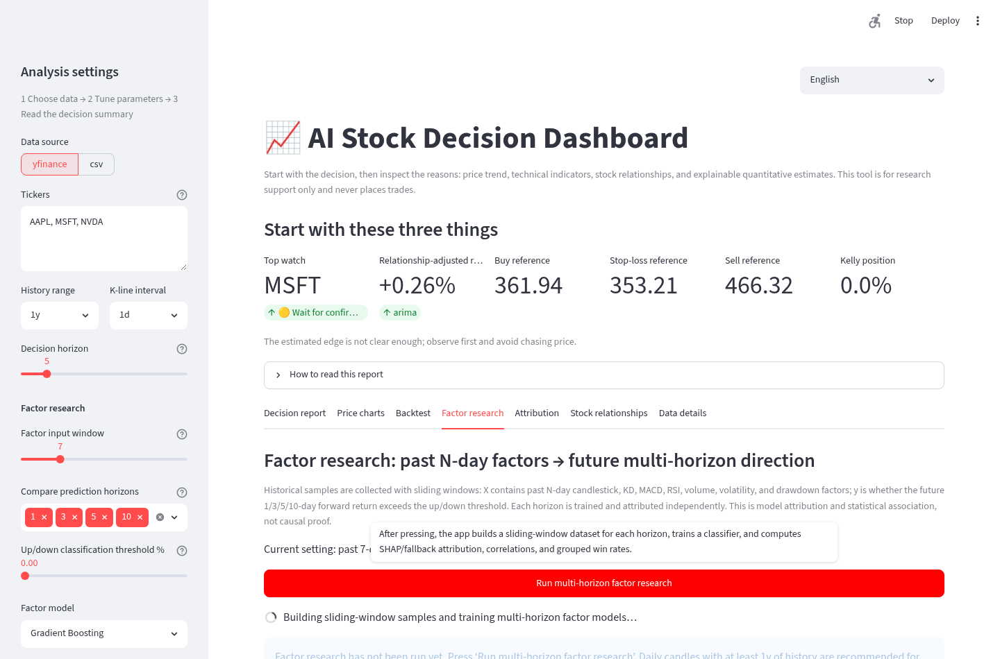

# AI_Stock

<p align="center">
  <a href="README.md"><strong>English</strong></a> |
  <a href="README-zh.md">繁體中文</a>
</p>

AI_Stock is a multilingual stock research and decision-support dashboard. It does not place trades automatically, and it does not present model output as financial advice. Its purpose is to help users inspect price action, technical indicators, walk-forward backtests, factor research, SHAP attribution, and cross-stock relationships in one Web UI.

## What it can do

- Multilingual Web UI: Traditional Chinese, English, Japanese, and Korean from the selector in the upper-right corner.
- Interactive historical price and candlestick charts.
- Technical snapshot: SMA, EMA, RSI, MACD, KD, MFI, ATR, Bollinger position, volume ratio, volatility, drawdown, support, and resistance.
- Decision report: model expected return, relationship-adjusted return, buy reference, sell reference, stop-loss reference, Kelly position, decision reason, and explanation for Kelly 0.0%.
- Walk-forward backtest: win rate, maximum drawdown, stop-loss hit rate, cumulative return, individual trades, and comparison across holding periods and exit rules.
- Factor research: sliding-window samples use past N days of candlestick, KD, MACD, RSI, volume, drawdown, and volatility factors as X, then use future 1/3/5/10-day up/down outcome as y. The report compares Accuracy, AUC, baseline, ticker × horizon heatmap, SHAP/fallback importance, correlations, grouped win rates, and y heatmap.
- SHAP / fallback attribution: triggered by button, so the dashboard does not recompute expensive attribution on every page load.
- Multi-stock return-correlation and positive/negative peer-pressure analysis.
- yfinance / CSV data sources. Docker mode stores yfinance cache under docker_runtime/market_cache.
- The futu-api Python package is included, but Futu OpenD still needs an external machine or remote OpenD service that can actually run OpenD.

## UI preview

The screenshots below show the English dashboard. The gallery uses HTML with inline CSS for horizontal scrolling. If a Markdown renderer filters CSS, the images still remain visible and may simply fall back to a vertical layout.

<div style="display:flex; overflow-x:auto; gap:16px; padding:8px 0 16px 0; scroll-snap-type:x mandatory;">
  <figure style="flex:0 0 760px; margin:0; scroll-snap-align:start;">
    
    <figcaption>Decision report: buy/sell/stop-loss references, relationship-adjusted return, and Kelly position.</figcaption>
  </figure>
  <figure style="flex:0 0 760px; margin:0; scroll-snap-align:start;">
    
    <figcaption>Price charts: candlestick trend, moving averages, and volume context.</figcaption>
  </figure>
  <figure style="flex:0 0 760px; margin:0; scroll-snap-align:start;">
    
    <figcaption>Walk-forward backtest: win rate, drawdown, stop-loss hit rate, and cumulative return curve.</figcaption>
  </figure>
  <figure style="flex:0 0 760px; margin:0; scroll-snap-align:start;">
    
    <figcaption>Stock relationships: return-correlation heatmap and positive/negative peer pressure.</figcaption>
  </figure>
  <figure style="flex:0 0 760px; margin:0; scroll-snap-align:start;">
    
    <figcaption>Factor research: multi-horizon Accuracy/AUC, ticker × horizon heatmap, and factor attribution.</figcaption>
  </figure>
</div>

## Project layout

- src/ai_stock/: stock analysis modules and Streamlit application.
- tests/: pytest behavior tests.
- spec/: project notes, task records, and beginner tutorial.
- spec/tutor_guide.md: beginner guide covering UI usage, technical terms, Kelly sizing, wait-for-confirmation decisions, backtesting, factor research, and example interpretation workflows.
- Dockerfile / docker-compose.yml / run.sh: Docker Compose entry points for one-command launch and management.

## Quick start with Docker Compose

Docker is the recommended way to run the dashboard.

```bash
cd /home/a0665x/Desktop/AI_AGX_WS/ai_stock_project/AI_Stock
./run.sh --help
./run.sh up
./run.sh status
```

Open the URL printed by run.sh status, for example:

```text
http://127.0.0.1:8507
```

If the host is logged into Tailscale, run.sh status and run.sh url also print Tailscale MagicDNS and Tailscale IP URLs.

Common commands:

```bash
./run.sh up          # build and start in background
./run.sh down        # stop and remove the container
./run.sh down_up     # down, rebuild, and start again
./run.sh restart     # alias of down_up
./run.sh log         # follow logs
./run.sh logs        # alias of log
./run.sh status      # compose ps + Local/LAN/Tailscale URLs
./run.sh url         # print URLs only
./run.sh test        # run pytest inside the container
./run.sh shell       # open a shell inside the container
```

If run.sh is not executable yet, use:

```bash
bash run.sh up
```

## Basic UI workflow

1. Choose the interface language from the upper-right selector: Traditional Chinese / English / Japanese / Korean.
2. Select a data source from the left sidebar: yfinance or CSV.
3. Enter ticker symbols, for example AAPL, MSFT, NVDA.
4. Choose the history period and candlestick interval. Beginners can start with 1y + 1d.
5. Start with Decision report: buy reference, sell reference, stop-loss reference, Kelly position, and reason for wait-for-confirmation.
6. Check Price charts to understand the current price location and trend.
7. Check Backtest for win rate, maximum drawdown, stop-loss hit rate, and cumulative return.
8. Check Factor research to compare which 1/3/5/10-day horizon has stronger signal.
9. When deeper explanation is needed, run Attribution or Factor research from the button-triggered sections.
10. Use Stock relationships to check whether selected stocks share the same risk exposure.

For a more detailed beginner explanation, read:

```text
spec/tutor_guide.md
```

## Docker cache

Docker Compose mounts:

```text
./docker_runtime:/app/runtime
```

yfinance disk cache is stored under:

```text
docker_runtime/market_cache/
```

After container restarts, the same ticker / period / interval combination can be loaded from disk cache first. To force fresh market data, click Re-fetch data / update analysis in the sidebar, or manually delete docker_runtime/market_cache/yf_*.pkl.

## Local development

```bash
cd /home/a0665x/Desktop/AI_AGX_WS/ai_stock_project/AI_Stock
uv venv .venv
. .venv/bin/activate
uv pip install -e '.[dev,futu]'
pytest -q
streamlit run src/ai_stock/app.py --server.headless true --server.port 8507 --server.address 0.0.0.0
```

## Core modules

- data_sources.py: OHLCV schema, yfinance fallback, Futu/OpenD adapter boundary, and market-data cache.
- analytics.py: technical snapshot, return correlation, and positive/negative peer pressure.
- forecasting.py: ARIMA / sklearn baseline, Kelly sizing, buy/sell/stop-loss references, and decision reasons.
- backtesting.py: walk-forward backtest plus holding-period and exit-rule comparison.
- attribution.py: SHAP TreeExplainer / permutation-importance fallback.
- factor_research.py: sliding-window technical-factor dataset, multi-horizon up/down classification, Accuracy/AUC trend, ticker × horizon heatmap, SHAP/fallback importance, correlations, grouped win rates, and y heatmap.
- pipeline.py: data → analysis → report pipeline.
- app.py: Streamlit UI and multilingual display layer.
- i18n.py: Traditional Chinese / English / Japanese / Korean UI language pack.

## Before pushing to GitHub

This repo includes a .gitignore that excludes:

- .venv, pytest cache, Python cache.
- runtime, docker_runtime, market-data cache, logs, sqlite, pkl/joblib/parquet local data.
- .env, token, credential, secret, and key files.
- .codex, .claude, .cursor, .hermes, AGENTS.md, CLAUDE.md, agent/codex logs, session transcripts, and local assistant traces.

Check before uploading:

```bash
git status --short
git status --ignored --short | head -80
```

## Push to the existing GitHub repo

The target repo is:

```text
https://github.com/a0665x/AI_Stock.git
```

If this local directory has not been initialized as a git repo:

```bash
cd /home/a0665x/Desktop/AI_AGX_WS/ai_stock_project/AI_Stock
git init
git branch -M main
git remote add origin https://github.com/a0665x/AI_Stock.git
git status --short
git add .
git status --short
git commit -m "Initial AI Stock dashboard"
git push -u origin main
```

If git is already initialized locally:

```bash
cd /home/a0665x/Desktop/AI_AGX_WS/ai_stock_project/AI_Stock
git remote -v
git remote add origin https://github.com/a0665x/AI_Stock.git  # only if origin is not set yet
git add .
git commit -m "Add multilingual AI Stock dashboard"
git push -u origin main
```

If GitHub asks for a password, paste your GitHub develop token into the password prompt. Do not write the token into any project file.

## Disclaimer

This project is for research and decision support only. It is not financial advice, and it does not perform automatic trading. Any buy/sell decision should also consider personal risk tolerance, position sizing, transaction cost, liquidity, and external market information.
